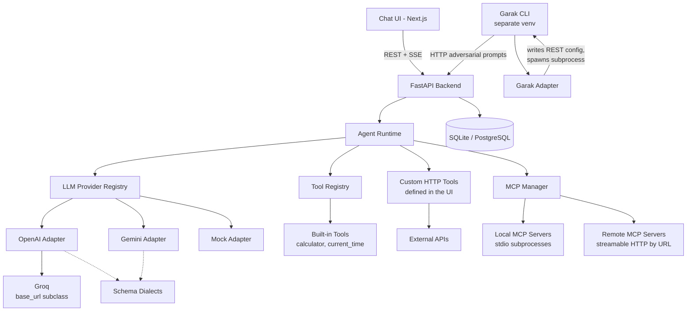
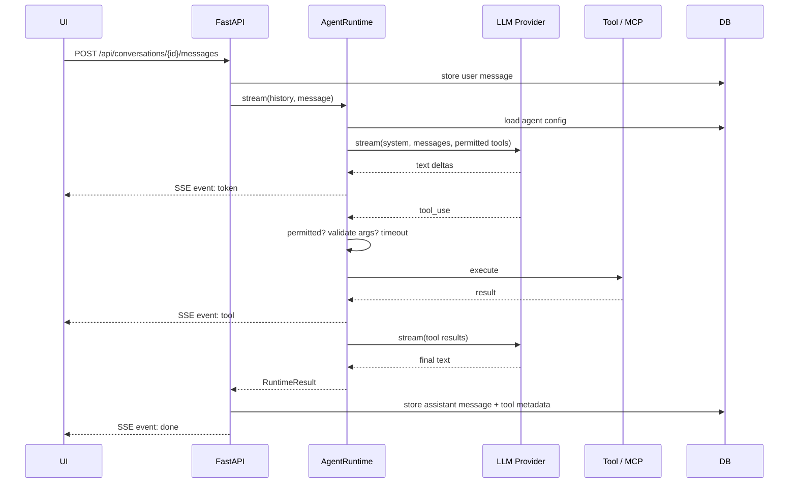
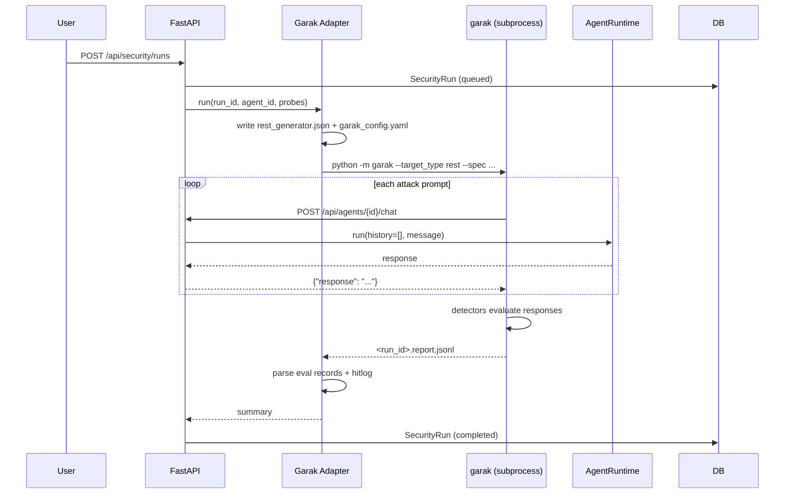
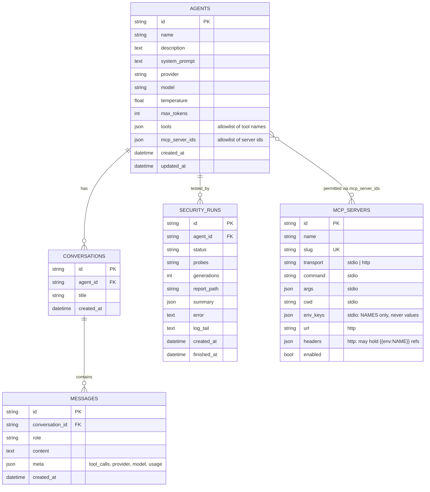

# Architecture

## System overview



The shape to notice: **Garak does not call the runtime directly.** It is an
ordinary HTTP client of the agent endpoint, so a scan measures the same code
path an external caller hits — permission gate included.

## Request flow

### Chat through the UI (streaming)



### Garak security scan



## Components

| Component | File | Responsibility |
|---|---|---|
| **API layer** | `app/api/*.py` | HTTP surface, validation, persistence orchestration. Holds no agent logic. |
| **AgentRuntime** | `app/services/agent_runtime.py` | The single execution loop. Loads an agent's config, calls the provider, gates and runs tool calls, returns a result. Identical for every agent and every caller. |
| **Provider registry** | `app/services/llm/registry.py` | Maps a provider name to an adapter instance. |
| **BaseLLMProvider** | `app/services/llm/base.py` | Provider-neutral contract: `generate()`, `stream()`, tool specs, tool calls. Nothing above this imports a vendor SDK. |
| **OpenAI adapter** | `app/services/llm/openai_provider.py` | The only module importing `openai`. Built on Chat Completions, and the base for any OpenAI-compatible vendor. |
| **Groq adapter** | `app/services/llm/groq_provider.py` | Three class attributes over the OpenAI adapter - a base URL, a name, an env var. |
| **Gemini adapter** | `app/services/llm/gemini_provider.py` | The only module importing `google-genai`. |
| **Schema dialects** | `app/services/llm/schemas.py` | Translates a tool's JSON Schema into what each vendor accepts. |
| **Mock adapter** | `app/services/llm/mock_provider.py` | Deterministic offline provider. Keeps tests hermetic and lets a Garak scan run without spending tokens. |
| **ToolRegistry** | `app/services/tool_registry.py` | Declares built-in tools with JSON Schemas and execution functions. |
| **HTTP tools** | `app/services/http_tool.py` | Runs tools defined through the UI, and is the security boundary for them: no code execution, no SSRF, no stored secrets. |
| **MCPManager** | `app/services/mcp_manager.py` | Connects to configured MCP servers over stdio or streamable HTTP, discovers tools, invokes them. The only module importing the MCP SDK. |
| **GarakAdapter** | `app/services/garak_adapter.py` | Generates garak's REST generator config, runs garak as a subprocess, parses its report. |
| **Models** | `app/models/*.py` | SQLAlchemy 2.0 mappings. String UUID keys and portable column types keep PostgreSQL a config change. |

## Key design decisions

### Agents are data, not code

An agent is a database row. There is no per-agent branching anywhere — adding
an agent is an `INSERT`, and `AgentRuntime` reads the row at request time.
Two agents differing only in `system_prompt` behave differently because the
runtime passes that column to the provider, not because any code knows about
them.

### One runtime, three callers

The streaming UI, the stateless agent endpoint, and Garak all execute
`AgentRuntime`. This matters for security testing specifically: if Garak
exercised a different path from the UI, a clean scan would say nothing about
what real users can do.

### A manual tool loop, not an SDK's tool runner

Several vendor SDKs offer a helper that runs the agentic loop for you (and the
Gemini SDK will call tools automatically unless told not to - this codebase
disables that explicitly). We write the loop ourselves because:

1. The **permission gate must live above the provider.** Letting a vendor SDK
   drive tool execution puts the security decision inside a dependency.
2. The runtime must stay **provider-agnostic**. The loop belongs above the
   provider abstraction, not inside one implementation of it.
3. Tool invocations are **recorded** as `ToolInvocation` records for the UI and
   for audit, which needs a hook at each step.

### Tool schemas are a dialect problem, not a tool problem

A tool declares one JSON Schema. The vendors disagree about what a tool schema
may contain — Gemini rejects `title`, `$schema`,
`additionalProperties` and `const` with a 400, and wants `parameters` omitted
rather than empty for a no-argument tool.

Translation lives in the adapter, not the tool registry, for one decisive
reason: **MCP tool schemas come from servers we do not control.** Pydantic puts
`title` on every property, so essentially every MCP-discovered tool would break
Gemini. Asking tool authors to write Gemini-safe schemas cannot work when we
did not write the tools.

Each adapter calls its own dialect helper internally rather than implementing an
abstract `prepare_schema` hook — there is no caller outside the adapter, so a
mandatory method on the base class would be ceremony without a consumer.

### Chat Completions is the interchange format

Vendors that serve an OpenAI-compatible endpoint get a `base_url` subclass
rather than an adapter. Groq is the first; Together, Fireworks, vLLM and
Ollama's compatibility endpoint would be the same three lines. The pay-off is
that translation bugs can only exist in one place, and the conformance suite
covers every such provider at once.

The cost is that a vendor's divergence from the format becomes this codebase's
problem. That is a deliberate bet: Groq's documented gaps are all fields we
never send, and a test pins that. If a vendor diverges further, its subclass is
the single place to override.

### Streaming needs accumulation, not a final-chunk read

Both streaming adapters assemble the assistant turn across chunks rather than
reading the last one:

* OpenAI sends a tool call's id and name once, then its arguments as fragments
  keyed by index.
* Gemini can emit a function call in **any** chunk, with usage-only chunks
  after it.

Reading only the final chunk looks correct in a text-only test and silently
drops tool calls - which is exactly the bug live testing caught in the Gemini
adapter. Both behaviours now have regression tests.

### Providers disagree about tool-call wiring

The neutral format carries a tool result as a block with both an id and a name,
because providers match a result to its call differently:

| | Assistant turn | Tool result |
|---|---|---|
| OpenAI | `tool_calls` on the assistant message | separate `role: "tool"` messages, matched by `tool_call_id` |
| Gemini | `functionCall` parts, role `model` | `functionResponse` parts, role `tool`, matched by **name** |

(Anthropic, were it added back, is a third shape again: `tool_use` blocks with
results returned as `tool_result` blocks inside a *user* message.)

`LLMMessage.raw` lets each provider replay its own assistant turn verbatim, so
ids and thought signatures survive a multi-step tool loop. A provider ignores a
`raw` it did not author and falls back to the neutral `content`.

Gemini may omit call ids entirely, so the adapter synthesises a stable one —
the runtime pairs results to calls by id regardless of what the vendor does.

### User-defined tools are data, and deliberately not code

The UI can define a tool, but only as an HTTP request. A builder that accepted
Python or shell would mean an agent that can create tools can create one that
runs anything - collapsing the boundary Garak exists to test. An HTTP call is
expressive enough for most real tools and has a boundary that can be enforced:

| Risk | Control |
|---|---|
| Code execution | None available; a definition is data, filled by regex substitution - never `str.format`, which on a user template reaches object internals |
| SSRF | Every resolved address checked before the request; loopback, private, link-local, reserved and multicast refused |
| Redirect escape | Redirects are not followed and are reported to the caller, since following one would bypass the address check |
| Secret leakage | Headers reference `{{env:NAME}}`; values are read at call time and never stored or returned |
| Path injection | Substituted values are URL-encoded, so a value cannot add path segments |
| Header forgery | `Host`, `Content-Length`, `Transfer-Encoding`, `Connection`, `Upgrade` refused |
| Runaway responses | Size cap and timeout, both configurable |

Custom tools share the agent's single `tools` allowlist with built-in ones, so
there is one permission surface rather than two, and creating a tool is never
the same as granting it.

### The tool permission gate

Every tool call — local or MCP — passes through the same three steps in
`AgentRuntime._execute_tool`:

```
model requests tool
   ↓
1. permitted for THIS agent?   (checked against the agent row)
   ↓
2. arguments valid?            (JSON Schema, before any execution)
   ↓
3. execute under a timeout
   ↓
result (or a refusal the model is told about)
```

A refused call returns a failed `ToolInvocation` rather than raising, so the
model is told it was denied and the turn continues. Refusals are logged.

An agent with an empty `tools` list has **no** tools — the empty case means
nothing, never everything.

### The calculator does not use `eval()`

`CalculatorTool` parses the expression to an AST and walks it against an
allowlist of node types, so `__import__("os").system(...)` is rejected at the
node level rather than executed. Exponents are bounded so `9**9**9` cannot
wedge the event loop. This is the pattern any future tool should follow: never
evaluate model output as code.

### Secrets never reach the model, the database, or the frontend

- API keys come from environment variables only.
- `mcp_servers.env_keys` stores variable **names**; values are read from the
  backend's environment at launch time.
- An MCP subprocess gets a **minimal** environment — a few variables needed to
  start a process, plus the ones its config names. It does not inherit the
  backend's environment, so it cannot read unrelated secrets.
- Garak receives the agent API key as `REST_API_KEY`; the generated config
  contains only the literal `$KEY` placeholder.

### The Garak endpoint returns 200 on internal failure

`POST /api/agents/{id}/chat` returns HTTP 200 with `metadata.error` set when the
runtime fails. Garak's `RestGenerator` treats any 4xx as a fatal
`ConnectionError` and aborts the entire scan, so one transient provider failure
would discard every result collected so far. Caller-side mistakes — unknown
agent, bad API key — still return real error codes, because those should fail
fast rather than be scored as model output.

### MCP connection model

One short-lived connection per operation, with discovery results cached for five
minutes. A persistent session pool would be faster, but holding MCP client
sessions across a web server's task scopes is real complexity for a POC. The
cache means the cost lands on tool calls, not on every chat turn.

An MCP server that cannot be reached **degrades** the agent rather than breaking
the turn: discovery failures are logged and the agent's other tools stay usable.

### Two transports, one code path

A `stdio` server is a local subprocess; an `http` server is a remote endpoint
reached by URL over streamable HTTP. The entire difference is `_target()`,
which returns either a `StdioServerParameters` or a streamable-HTTP transport.
`discover()` and `call_tool()` cannot tell them apart, so caching, namespacing,
argument validation, the per-agent allowlist and graceful degradation are
written once and apply to both.

The remote transport exists so a server can be added **without code on this
machine** — the MCP counterpart of the user-defined HTTP tools. It reuses their
SSRF guard verbatim: a URL someone types into the UI is no more trustworthy
because it happens to speak MCP.

| Risk | Control |
|---|---|
| Reaching internal services | `assert_safe_url` rejects loopback, private, link-local, reserved and multicast addresses, including `169.254.169.254` |
| Escaping that check by redirect | Redirects are not followed |
| Non-HTTP schemes | `http`/`https` only, so no `file://` |
| Secrets in the database | Header values hold `{{env:NAME}}`; resolution happens at connect time |
| Request smuggling | Hop-by-hop headers (`Host`, `Content-Length`, `Connection`, …) are dropped |

What it does **not** control is the server's *content*. Tool names, descriptions
and schemas come from whoever runs it and land in the model's prompt, so adding
a remote server is a trust decision about that operator — the same one you make
installing any third-party dependency.

### Conversation history

History is replayed as plain text turns. Tool round trips are recorded in
message metadata for display but not resent, which keeps context small and
avoids replaying stale tool-use ids. History is scoped to a conversation, and
conversations are scoped to an agent, so context never crosses agents.

## Database schema



`agents.tools` and `agents.mcp_server_ids` are JSON arrays rather than join
tables. For a POC this keeps the agent a single readable row; the trade-off is
no referential integrity on those ids, which the runtime handles by skipping
ids it cannot resolve.

## PostgreSQL compatibility

- String UUID primary keys, not autoincrementing integers.
- `JSON` (the generic type), not `JSONB` or SQLite-specific types.
- `DateTime(timezone=True)` throughout.
- The only SQLite-specific code is the `check_same_thread` connect argument in
  `app/db/session.py`, which is applied behind a dialect check.

Switching is a `DATABASE_URL` change plus `psycopg`. Schema creation currently
uses `Base.metadata.create_all()`; a real deployment should add Alembic.

## Known architectural limits

| Limit | Consequence | Path forward |
|---|---|---|
| `create_all()` instead of migrations | Schema changes need a manual reset | Add Alembic |
| Connection per call | ~200-400ms for a stdio subprocess; far less for HTTP | Persistent session pool |
| Model suggestions are a static list | Goes stale as vendors ship models | Query each provider's `models.list()` - though note a listed model can still 404 on use, so a live list is necessary but not sufficient |
| Per-server MCP permissions | An agent gets all of a server's tools, or none | Per-tool allowlist |
| Security runs are in-process asyncio tasks | Runs do not survive a restart | Move to a task queue |
| No authentication on the UI endpoints | Anyone reaching the port can act | Add auth before any shared deployment |
| History is replayed as text | Multi-turn tool context is not re-sent | Persist provider-native blocks |
